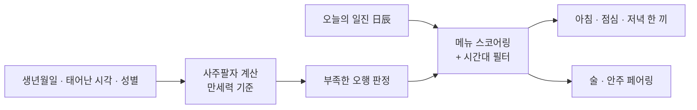

# Energy Meal 🍚

**오늘의 기운으로 고르는 한 끼.**

생년월일로 사주팔자를 읽어 부족한 오행을 찾고, 아침 · 점심 · 저녁 — 그리고 술상까지 오늘의 메뉴를 추천한다.
같은 사람이라도 일진(日辰)이 바뀌면 추천이 달라진다.

| 구분 | 여느 메뉴 추천 | 에너지밀 |
|---|---|---|
| 추천 기준 | 취향 · 랜덤 | 만세력 기반 사주팔자 · 오행 분석 |
| 갱신 | 새로고침마다 제각각 | 하루 한 번 고정 — 자정에 일진 따라 갱신 |
| 내 데이터 | 서버 수집 | 기기 안에만 — 서버도 계정도 없음 |

**바로 보기** — [서비스](https://energy-meal-hybrid.vercel.app) · [기능명세서](https://energy-meal-hybrid.vercel.app/docs) · [디자인 시안](https://energy-meal-hybrid.vercel.app/docs/design.html) · [앱 다운로드](#앱-다운로드)

---

## 화면

  
  
  
  
  

전체 시안은 [디자인 시안 (웹)](https://energy-meal-hybrid.vercel.app/docs/design.html)에서 —
화면 10장과 디자인 시스템 5장을 배포된 서비스 안에서 그대로 열람할 수 있다.

---

## 주요 기능

**사주 · 오행 추천**
- 생년월일 · 태어난 시각(십이시) · 성별 · 양력/음력만 입력하면 끝 — 계정도 로그인도 없다
- 만세력 기준 사주팔자에서 **부족한 오행**을 찾고, **오늘의 일진(日辰)** 과 결합해 스코어링한다
- 하루 한 번 고정 추천 — 자정이 지나 일진이 바뀌면 추천도 달라진다
- 결과 화면에 **사주 풀이** 노출 — 일간(나의 기운) · 오늘의 일진 · 추천 근거를 문장으로 풀어준다

**시간대별 한 끼**
- 접속 시각에 따라 아침 / 점심 / 저녁 탭이 기본 선택된다
- 한식 · 분식 · 중식 · 일식 · 양식 · 아시안 **1,000개 메뉴**, 메뉴별 개별 컷의 AI 푸드 포토그래피 **964종**
- 이미지 평균 색상에서 배경 팔레트를 추출한다 — 화면 톤이 메뉴를 따라간다
- 다시 추천하기 — 추천 순환 + 이미지 프리로드로 플리커 없이 전환되고, 결과는 그날 하루 유지된다

**안주 페어링 (나이트 모드)**
- 소주 · 맥주 · 와인 · 막걸리 · 위스키 · 사케 — 술을 고르면 어울리는 안주를 추천한다
- 포차 · 바 씬 이미지와 나이트 모드 UI로 술상 분위기를 낸다

**앱 · 설치**
- PWA — 홈 화면 설치, 서비스워커 오프라인 폴백 (네트워크가 없어도 마지막 추천을 볼 수 있다)
- 설치 배너 — 크로미움은 네이티브 프롬프트, iOS는 "공유 → 홈 화면에 추가" 가이드로 갈린다
- Expo WebView 셸에 임베드되면 이를 감지해 전체 화면 레이아웃으로 전환한다
- 앱은 끼니 시간(07:30 · 11:30 · 17:30)에 맞춰 알림을 보낸다

---

## 추천이 만들어지는 과정

- 음력 입력은 한국 만세력 기준으로 양력 변환 후 계산한다 — 년주는 입춘, 월주는 절기 기준
- 이 흐름 전부가 **기기 안에서** 돈다 — 서버도, 계정도, 전송도 없다

---

## 앱 다운로드

Android 폰 카메라로 QR을 찍으면 다운로드 페이지가 열리고 최신 APK 다운로드가 바로 시작된다.
카카오톡 등 인앱 브라우저에서 열어도 외부 브라우저로 자동 전환돼 설치가 막히지 않는다.

**[⬇ 최신 APK 받기](https://energy-meal-hybrid.vercel.app/download)** · [버전별 릴리즈 보기](../../releases)

- 배포된 웹을 담는 하이브리드 앱이라, 웹이 갱신되면 앱도 재설치 없이 함께 갱신된다
- 설치 시 "출처를 알 수 없는 앱" 허용이 필요하다 (스토어 외 배포)
- APK로 설치했다면 추후 Google Play 버전으로 옮길 때 기존 앱을 삭제 후 재설치해야 한다 — 서명이 달라 덮어쓰기 업데이트가 되지 않는다

**웹으로 쓰기** — 설치 없이 [브라우저](https://energy-meal-hybrid.vercel.app)에서 바로 쓴다. 홈 화면에 추가하면 앱처럼 뜬다.
**iOS** — 스토어 외 앱 설치가 막힌 플랫폼이라, 웹에서 "공유 → 홈 화면에 추가"로 설치해 쓴다.

 

---

## 이 저장소는

에너지밀의 **릴리즈 배포와 사용자 지원**을 위한 공간이다. 앱 소스 코드는 비공개 저장소에서 관리한다.

- **[릴리즈](../../releases)** — 버전별 변경사항과 안드로이드 APK
- **[CHANGELOG](./CHANGELOG.md)** — 사용자에게 보이는 변경 이력
- **[문의 · 버그 신고](../../issues)** — 이슈로 남기면 확인한다
- **[개인정보처리방침](./docs/privacy.md)**

---

## 개인정보

에너지밀은 **입력한 정보를 서버로 보내지 않는다.** 생년월일과 태어난 시각은 기기 안에만 저장되고,
사주 계산도 기기 안에서 이루어진다. 계정도 로그인도 없다.

자세한 내용은 [개인정보처리방침](./docs/privacy.md)에.

---

## 문서

| 문서 | 내용 |
|---|---|
| [기능명세서 (웹)](https://energy-meal-hybrid.vercel.app/docs) | 버전별 명세를 배포된 화면에서 읽는다 |
| [디자인 시안 (웹)](https://energy-meal-hybrid.vercel.app/docs/design.html) | 화면 10장 · 디자인 시스템 5장 |
| [명세 v1](https://energy-meal-hybrid.vercel.app/docs/spec-v1.html) | 출시 기능 전체 — 생일 규칙 기반 추천 엔진 (구버전) |
| [명세 v2](https://energy-meal-hybrid.vercel.app/docs/spec-v2.html) | 사주팔자 · 오행 엔진 — 설계와 구현 결정 기록 (구버전) |
| [명세 v3](https://energy-meal-hybrid.vercel.app/docs/spec-v3.html) | 술 · 안주 페어링 — 나이트 모드 (현행) |
| [CHANGELOG](./CHANGELOG.md) | 사용자에게 보이는 변경 이력 |
| [개인정보처리방침](./docs/privacy.md) | 수집 항목 없음 — 전부 기기 안 |

---

## 기술 스택

| 구분 | 사용 |
|---|---|
| Framework | Next.js 16 (App Router) · React 19 |
| Language | TypeScript |
| Styling | Tailwind CSS 4 · Motion |
| 폼 · 검증 | React Hook Form + Zod |
| 사주 엔진 | lunar-typescript · korean-lunar-calendar — 만세력 대조 golden test로 검증 |
| App | Expo (React Native WebView 셸) |
| 테스트 | Vitest · React Testing Library · Playwright |
| 배포 | Vercel — 서버 없는 100% 클라이언트 사이드 |

---

## 문의

버그 제보와 기능 제안은 [이슈](../../issues)로 받는다.
